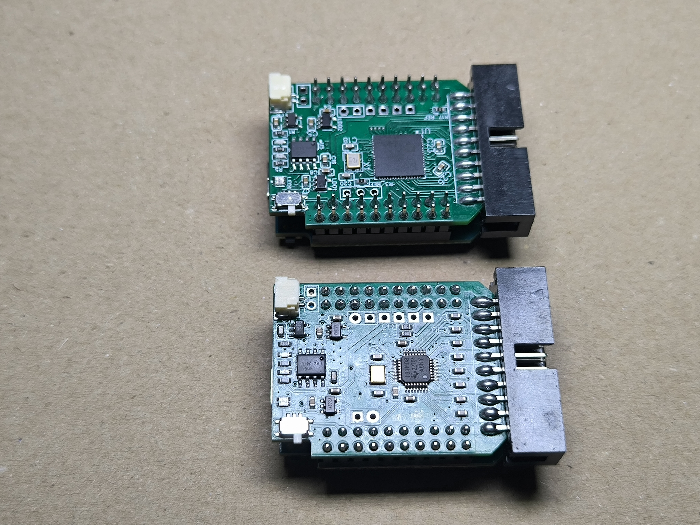
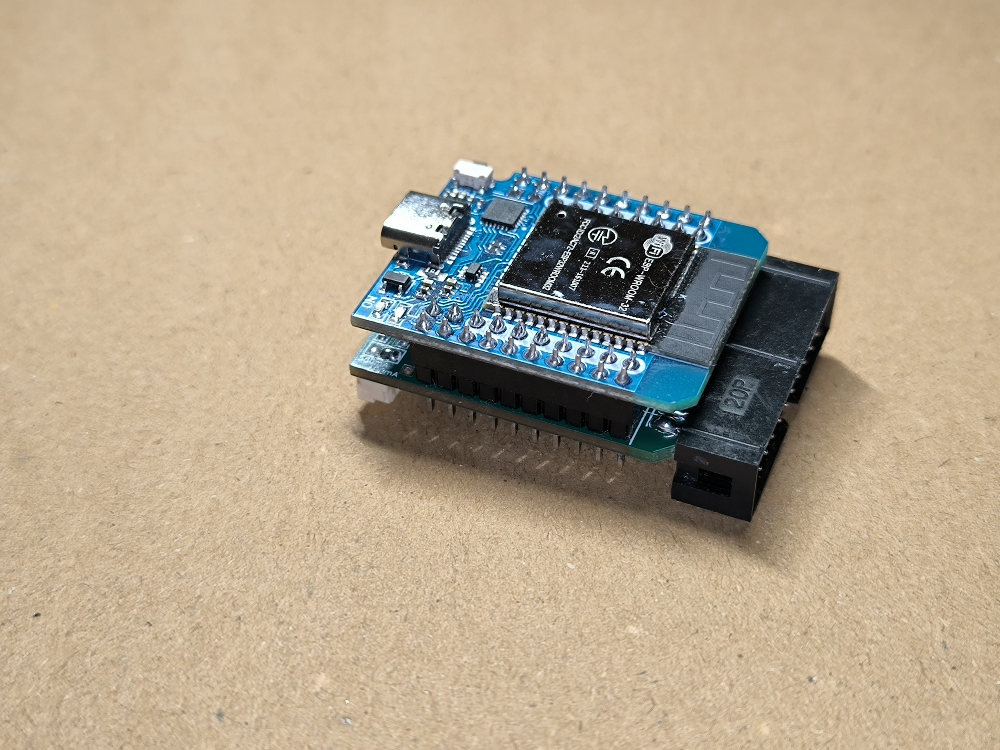

# BioListener Firmware

**BioListener** is based on the **ESP32 D1 MINI** module (ESP-WROOM-32).

The firmware utilizes **PlatformIO** and the **Arduino framework** to enable easy and user-friendly code development. This setup provides seamless integration with open-source Arduino Framework developments and allows for easy adaptation to specific use cases.

  

  

## Communication Methods

### Currently Supported
- **WiFi TCP**: Real-time biosignal data transmission to the **BrainFlow server**.

### Planned
The following features are planned for future updates:
- **Bluetooth / BLE**: Real-time data transmission over Bluetooth / BLE support.
- **Offline Mode**: Data storage on **SD card**.
- **Unstable Networks Support**: Mode to handle unreliable network connections.
- **Big Data IoT Server**: Real-time data capture and processing from many boards.

## Easy Getting Started for Users
- To flash the firmware to the **ESP32 D1 MINI** module, download the latest firmware from the GitHub Actions page.
- Use [online web tool from Espressif](https://espressif.github.io/esptool-js/) to flash the firmware to the **ESP32 D1 MINI** module.

## Getting Started For Developers
- Install the **PlatformIO** extension in **Visual Studio Code**.
- Use `platformio.ini` to configure the project settings and set build flags (specified below):
  - **ADC_USED**:  0: ADC_ADS131M08, 1: ADC_AD7771
  - **IMU_DISABLE**: 0: IMU_ENABLE, 1: IMU_DISABLE
- Build the project using the **PlatformIO** extension in **Visual Studio Code**.
- Upload the firmware to the **ESP32 D1 MINI** module using the **PlatformIO** extension in **Visual Studio Code**.

## Usage
For the first run, the **ESP32 D1 MINI** module will create a WiFi access point named `BioListener_******`. Connect to this access point and open the IP address `192.168.4.1` in your browser. You will be redirected to the configuration page, where you can set up the WiFi connection and BrainFlow server settings (IP address and port).  

After the configuration is complete, the **ESP32 D1 MINI** module will connect to the specified WiFi network.  

After every device start, you have ability to connect to configuration page available at `BioListener_******` WiFi access point. It will be available for 2 minutes after device start or until BrainFlow server connection is established.

## License

This repository uses the following licenses:
- **Code**: The code in this repository is licensed under the [GNU General Public License v3.0 (GPL-3.0)](https://www.gnu.org/licenses/gpl-3.0.html).
